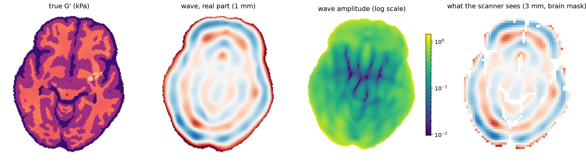
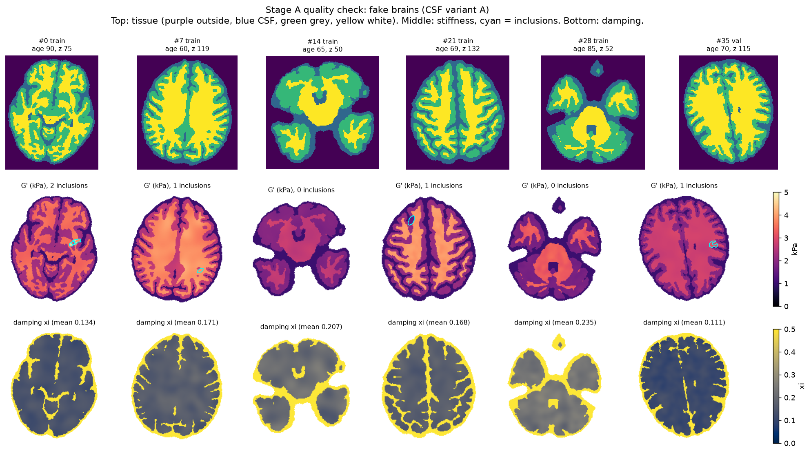
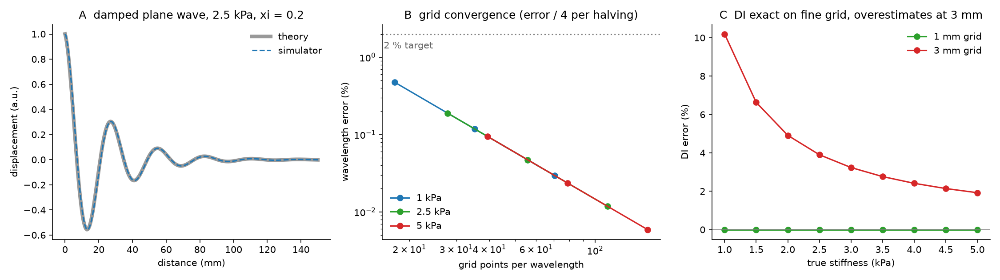
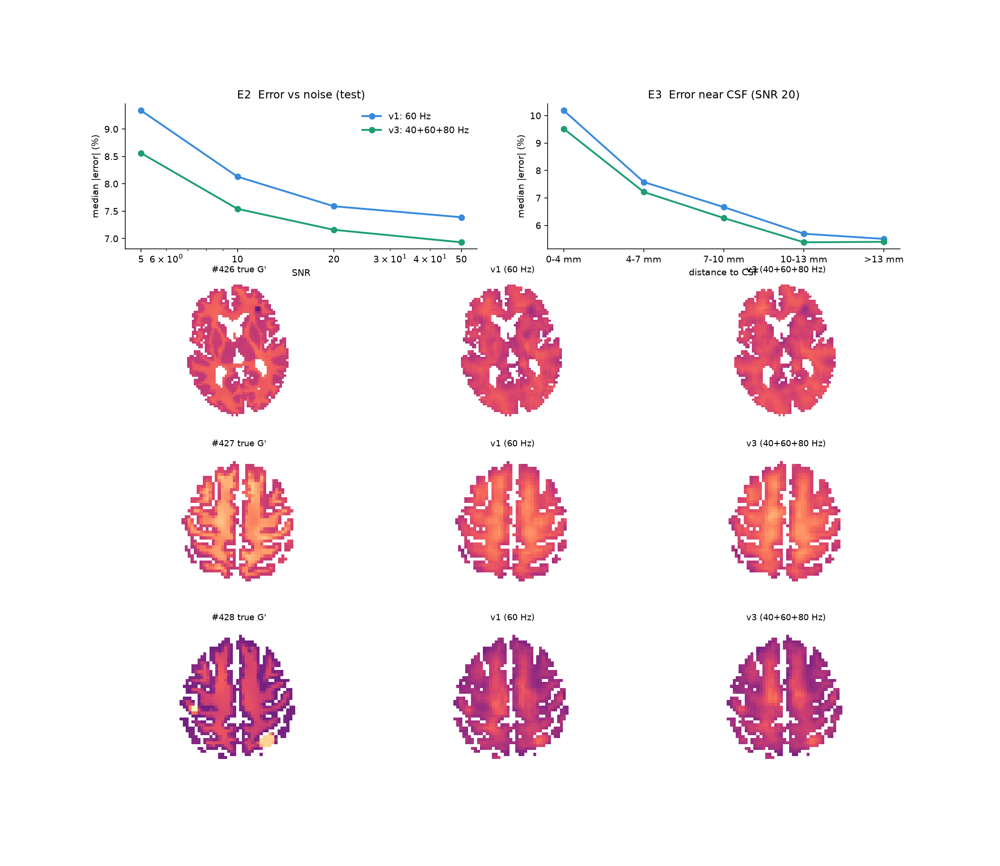
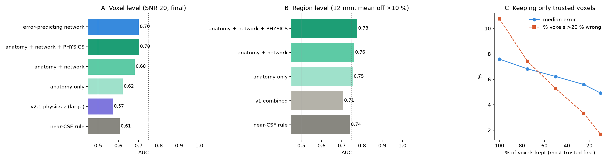
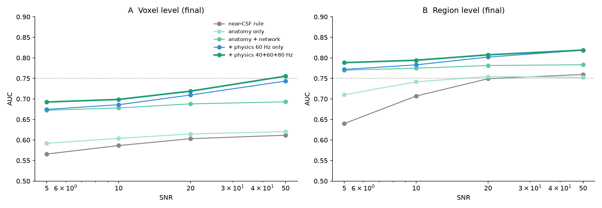
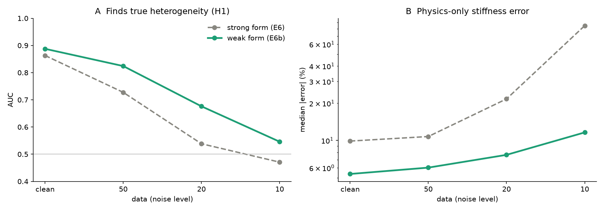
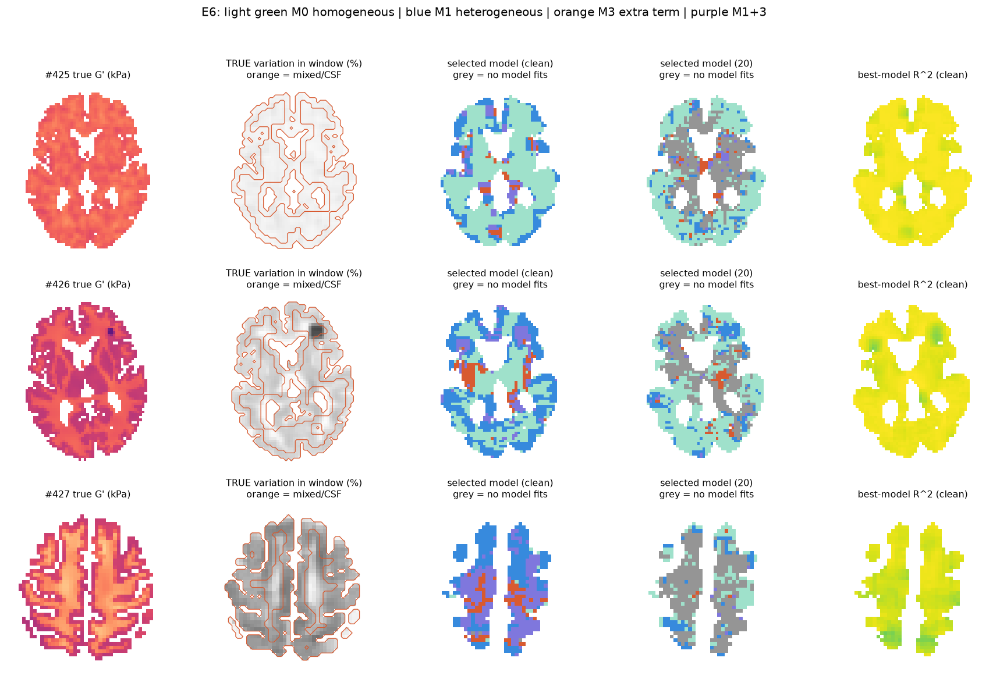

# MRE inversion with synthetic ground truth: a 2D pilot

Learning brain stiffness from MR elastography (MRE) waves, using synthetic brains where the true stiffness is known. The pipeline also builds a physics-based **trust map** that flags where the stiffness estimate is likely wrong, and uses **system identification** (SINDy) to check which wave equation the tissue actually follows.

> Status: 2D pilot, all experiments frozen (October 2026). Synthetic data only.

---

## Why

MRE vibrates the head, images the shear waves inside the brain, and turns the wave pattern into a stiffness map (*inversion*). Stiffness is a biomarker for ageing and neurodegeneration. Standard inversion (direct inversion, DI) has two problems: it is unreliable near CSF and at tissue boundaries, and it gives **no warning** when it is wrong. Real scans have no ground truth, so we cannot check them.

This pilot uses synthetic brains with **known stiffness** to:

1. train a neural network to do the inversion,
2. measure exactly where and why it fails,
3. build a trust map from physics that flags those failures,
4. identify, from the data alone, which wave equation holds in each region.



## Pipeline

```
SynthSeg templates ──► A: synthetic brains (stiffness G′, damping ξ, inclusions)
                         │
                         ▼
                       B: wave simulator (2D shear, finite differences, 0.5 mm → 3 mm)
                         │  validated against theory (checkpoint C1)
                         ▼
                       C: 7×7 patches + noise ──► MLP ensemble (ILI / HLI)
                         │
                         ▼
                       D: evaluation vs direct inversion (E2 noise, E3 near-CSF, inclusions)
                         │
                         ▼
               E5 / F: trust map (physics check + anatomy + network spread)
                         │
                         ▼
                 E6 / E6b: system identification (strong- and weak-form SINDy)
```

The 500 brains are split **by slice level** into 350 train / 75 validation / 75 test, so neighbouring slices never leak across splits. Every method was developed on the validation brains and run on the test brains **once**.


*Synthetic brains: tissue labels (top), true stiffness with inclusions outlined (middle), damping (bottom).*

## Code

### Shared modules

| File | What it does |
| --- | --- |
| `mre_solver.py` | Wave simulator: complex modulus, conservative finite differences with harmonic face averaging, skull drive, sparse direct solve, block-averaging to 3 mm |
| `mre_patches.py` | Noise model, patch extraction, targets, phase augmentation |
| `mre_patches_mf.py` | Same for three frequencies (40 / 60 / 80 Hz) |
| `mre_di.py` | Direct inversion baseline |

### Scripts, in the order they are run

| Stage | Script | Purpose |
| --- | --- | --- |
| A | `stage_a_make_brains.py` | 500 synthetic brains from SynthSeg templates: tissue labels → stiffness, damping, random stiff/soft inclusions |
| B | `b1_checks.py` | **Checkpoint C1**: plane-wave test, grid convergence, DI bias at 3 mm |
| B | `stage_b2_simulate.py` | Simulate 60 Hz waves for all brains (restartable, parallel) |
| C | `stage_c1_make_patches.py` | 500k train / 80k validation patches, noise at SNR 5–50 |
| C | `stage_c2_train.py` | Train MLP ensembles (5 × ILI, 2 × HLI), early stopping |
| D | `stage_d1_evaluate.py` | E2 (error vs noise), E3 (error vs distance to CSF), inclusion contrast |
| E5 v1 | `stage_e1_trust_map.py` | First trust map (physics residual + ensemble spread) |
| v2 | `stage_f1_predict_val.py` | Predictions on validation brains (for development) |
| v2 | `stage_f2_trust_v2.py` | Trust map v2: dev/final split, noise floor, fair baselines |
| v2.1 | `stage_f3_trust_v21.py` | Noise-debiased physics correction (method of moments) + 3 mm grid-bias correction + region-level model. `python stage_f3_trust_v21.py final` runs on test |
| v2.1 | `stage_f4_bootstrap.py` | Paired bootstrap over test brains (1,000 redraws) |
| v3 | `stage_b3_simulate_multifreq.py` | Same brains at 40 and 80 Hz |
| v3 | `stage_c3_patches_train_mf.py` | Multi-frequency patches (343 inputs) + network. Modes: `patches`, `quick`, `train` |
| v3 | `stage_d2_evaluate_mf.py` | Multi-frequency network vs 60 Hz network on identical noisy data |
| v3 | `stage_f5_trust_mf.py` | Trust map with physics pooled over three frequencies |
| E6 | `stage_e6_model_selection.py` | Strong-form SINDy: which equation (uniform / varying / extra term) fits each 15 mm window |
| E6b | `stage_e6b_weak_sindy.py` | Weak-form SINDy (Messenger & Bortz 2021): derivatives moved onto test functions for noise robustness |

Figures shown in this README are in `figures/`. All outputs go to `mre_project/` (not in this repository: it holds several GB of generated data and can be rebuilt by running the scripts in order).

## Key results (75 held-out test brains)

**Simulator (C1).** Wavelength error < 0.6 %, second-order grid convergence. DI is exact on a fine grid but biased +10 % (1 kPa) to +2 % (5 kPa) at the 3 mm scanner resolution.


*Simulator matches theory (A), converges at second order (B); direct inversion is biased on the 3 mm grid (C).*

**Network vs direct inversion (SNR 20).**

| | DI | HLI | ILI |
| --- | --- | --- | --- |
| Median error | 10.3 % | 8.6 % | **6.8 %** |
| Correlation | 0.50 | 0.77 | **0.84** |
| Inclusion contrast recovered | 22 % | 23 % | **35 %** |

Within 4 mm of CSF (28 % of voxels), DI is undefined; ILI error is 10.2 %.


*60 Hz network (v1) vs 40+60+80 Hz network (v3): lower error at every noise level and every distance from CSF.*

**Trust map: how well it ranks badly wrong voxels (> 20 % error), AUC.**

| Version | SNR 20 voxel AUC | Note |
| --- | --- | --- |
| Near-CSF rule (baseline) | 0.61 | |
| v1 | 0.60 | lost to the baseline |
| v2.1 | 0.70 | physics gain +0.021 [0.013, 0.030] (bootstrap 95 %) |
| v3, three frequencies | **0.719** | 0.756 at SNR 50; region level 0.81 |

Keeping only the 10 % most trusted voxels cuts badly wrong voxels from 10.8 % to 1.7 %. Three-frequency physics adds a significant gain even at SNR 5, where 60 Hz physics alone adds nothing.


*v2.1 trust map: voxel AUC (A), region AUC (B), and how keeping only trusted voxels removes badly wrong ones (C).*


*v3 trust map: three-frequency physics (thick green) is best at every noise level.*

**System identification: strong vs weak SINDy.**

| Data | Finds true heterogeneity (AUC) | Physics-only stiffness error |
| --- | --- | --- |
| Clean | 0.86 → **0.89** | 9.9 % → **5.4 %** |
| SNR 20 | 0.54 → **0.68** | 21.7 % → **7.7 %** |
| SNR 10 | 0.47 → **0.55** | 84.9 % → **11.6 %** |


*Weak-form SINDy (green) stays accurate under noise where strong-form (grey) breaks down.*


*Which equation fits where: light green uniform (M0), blue varying stiffness (M1), orange extra term (M3), purple both, grey nothing fits.*

## Limitations

- 2D, synthetic data, one CSF model (CSF simulated as a soft solid, so CSF "missing physics" cannot be detected).
- Physics gains are real but small (+0.01 to +0.03 AUC); voxel-level AUC stays below 0.75 except at SNR 50.
- The physics check flags errors but cannot yet correct the network (r ≈ 0.05).
- Strong and weak SINDy are scored on different voxel sets (weak form needs interior voxels).
- Bootstrap intervals cover the choice of test brains, not network retraining.

## Next steps

Fluid CSF model, 3D simulation, larger receptive fields (U-Net), weak-form residual as a training loss, and application to real MRE data.

## Setup

Python 3.10+, CPU only.

```
python -m venv .venv
.venv\Scripts\activate          # Windows
pip install -r requirements.txt
```

SynthSeg CN templates go in `example/` (not included, see the SynthSeg repository).

## References

- Brunton, Proctor & Kutz (2016). Sparse identification of nonlinear dynamics (SINDy). *PNAS* 113(15).
- Rudy et al. (2017). Data-driven discovery of partial differential equations. *Science Advances* 3(4).
- Messenger & Bortz (2021). Weak SINDy for partial differential equations. *J. Comput. Phys.* 443.
- Billot et al. (2023). SynthSeg. *Medical Image Analysis* 86.
- Hiscox et al. (2016). MR elastography of the human brain. *Phys. Med. Biol.* 61(24).
- Murphy et al. (2018). Neural networks for stiffness estimation in MRE. *Magn. Reson. Med.* 80(1).
- Papazoglou et al. (2012). Multifrequency inversion in MRE. *Phys. Med. Biol.* 57(8).
